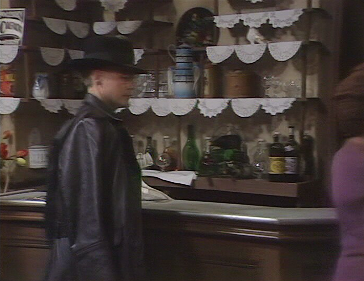
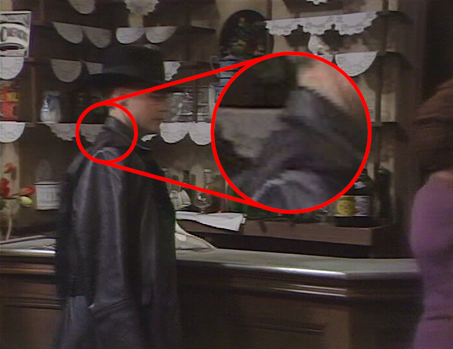

==========
Recipes
==========

Ripping discs is much more art than science, and there are numerous edge cases
that you may run into. This section tries to cover what to do in some of these
scenarios.

Blu-ray ripping
===============

While DVDs still seem to be the most common format for TV series, Blu-rays are
becoming incresingly common. Unfortunately, ripping Blu-ray is rather more
complex and requires some one-time setup to get started.

Whilst the encryption on DVDs (:abbr:`CSS (Content Scrambling System)`) is
relatively trivial for a modern machine to bypass, the encryption on Blu-rays
(:abbr:`AACS (Advanced Access Content System)`) cannot be bypassed without
some knowledge of the keys, which are periodically expired with new ones being
released.

Thankfully, some extremely kind people maintain a database of the currently
known keys at the `FindVUK Online Database`_. To configure your system to use
these:

#. Visit the `FindVUK Online Database`_ and download the current
   :file:`keydb.cfg` file. This is served as a `ZIP archive`_.

#. Create the :file:`.config/aacs` folder under your home directory::

       mkdir ~/.config/aacs

#. Extract :file:`keydb.cfg` from the archive, and move it under the created
   folder, renaming it to :file:`KEYDB.cfg` (the case sensitivity matters)::

       unzip keydb_eng.zip
       mv keydb.cfg ~/.config/aacs/KEYDB.cfg

With this done, you should be able to both scan and rip Blu-ray discs of TV
series.

Fixing "combing" artifacts
==========================

Broadcast video today commonly uses "progressive scan", which is just a
technical way of saying that each frame of video is broadcast fully, top to
bottom. However, video from before the 2000s (roughly) was commonly broadcast
"`interlaced`_". This doubled the frame-rate but broadcast only half the
horizontal lines for each frame.

DVDs from this era commonly contain interlaced video too. If this is encoded
directly into a progressive format, you will wind up with "combing" at the
edges of anything moving horizontally from frame to frame, as illustrated
below:

          of the bar. Combing artifacts are clearly visible at the edge of his
          hat and chin.

Not only is this unpleasant to look at, it also ruins the compression ratio of
the video as the combing produces lots of "fine edges" that the encoder will
struggle to compress. The :doc:`var_decomb` setting can be used to deinterlace
such sources when ripping::

    (tvrip) set decomb on

By default this setting is ``off`` because it does notably increase the time it
takes to rip things, and may also reduce quality if deinterlacing is mistakenly
applied where it is not needed (although the quality reduction is arguably so
minimal as to be unnoticeable). With this setting activated the above frame
becomes:

          deinterlacing applied. The combing is no longer visible on Herr
          Otto Flick's hat and chin.

There are cases of sources which are *selectively* interlaced. This is fairly
common on shows from the late 90s to early 2000s, in particular where visual
effects are concerned. The majority of the show appears progressively encoded,
but whenever something computer generated is on screen (including overlaid
title cards), combing suddenly appears. This was a result of combining video
sources, one of which was progressive and one interlaced. In such cases, the
:doc:`var_decomb` configuration should be set to "auto"::

    (tvrip) set decomb auto

This will attempt to detect combing and only apply the deinterlacing to frames
where it appears.

Ignoring duplicated titles
==========================

TBC -- cover duplicates setting, when to use it and when not to, and why
duplicate tracks typically exist

Mapping chapter-based episodes
==============================

TBC -- automapping by playback example (try and find an actual example; Robot
Chicken was definitely one)

Multipart episode handling
==========================

TBC -- how kodi (and therefore tvrip) expects these to be named, how
automapping looks for duration multiples

Format selection tips
=====================

TBC -- mp4 vs mkv, aac vs mp3, etc. -- compatibility versus flexibility

.. _CSS: https://en.wikipedia.org/wiki/Content_Scramble_System
.. _AACS: https://en.wikipedia.org/wiki/Security_of_Advanced_Access_Content_System
.. _FindVUK Online Database: http://fvonline-db.bplaced.net/
.. _ZIP archive: https://en.wikipedia.org/wiki/ZIP_(file_format)
.. _interlaced: https://en.wikipedia.org/wiki/Interlaced_video
